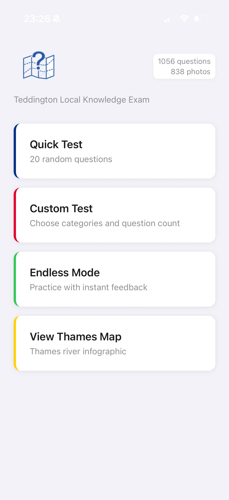
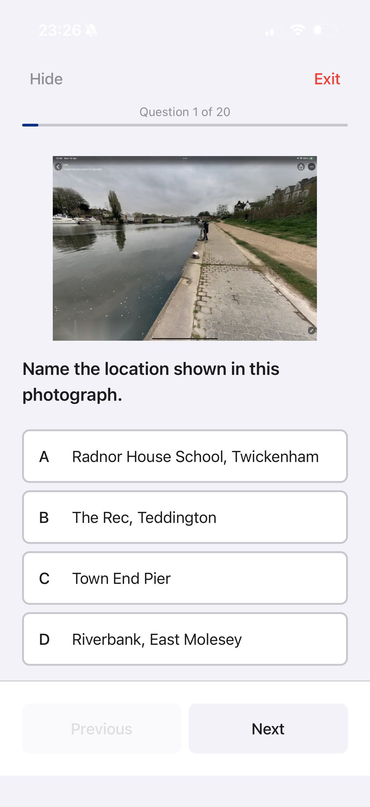
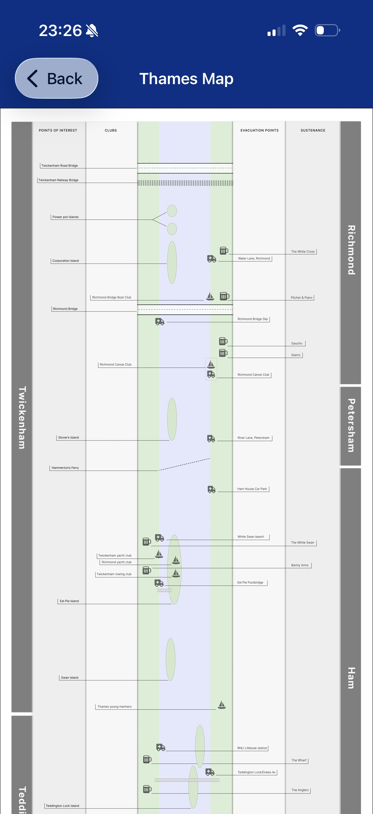

# Teddington Local Knowledge Exam

An unofficial study app for crew members at Teddington Lifeboat Station to prepare for local knowledge exams. Built with React Native and Expo.

The app covers the Thames from Hampton Court to Richmond, testing crew members on geography, landmarks, locks, warning systems, hazards, and evacuation points through photo-based multiple-choice questions. The pass threshold is 90%.

<p align="center">
  
  &nbsp;&nbsp;
  
  &nbsp;&nbsp;
  
</p>

## Features

- **Quick Test** - 20 random questions across all categories
- **Custom Test** - Choose specific categories and question count
- **Endless Mode** - Continuous practice with instant feedback
- **Thames Map** - Interactive infographic showing points of interest, clubs, evacuation points, and landmarks along the river
- **838 reference photos** covering the operational area
- **Review mode** to revisit incorrect answers with explanations
- **Progress tracking** with cumulative stats

## Question Categories

| Category | Description |
|----------|-------------|
| Evacuation Points | Tidal and non-tidal evacuation points along the Thames |
| Islands | 15 islands from Ash Island to Isleworth Ait |
| Bridges | 10 bridges from Hampton Court Bridge to Richmond Lock Footbridge |
| Establishments | Pubs, hotels, restaurants, clubs and water activity centres |
| Points of Interest | Parks, piers, landmarks, rivers and other notable locations |
| Richmond Lock | Operations, signals, exclusion zones and procedures |
| Teddington Lock | Three-lock system, weir hazards and operational procedures |
| PLA Warnings | PLA flag warning system (RED, YELLOW, GREEN, BLACK) |
| EA Warnings | Environment Agency warning boards and appropriate actions |
| Hazards | Fog-prone areas, weir dangers and safety considerations |

## Tech Stack

- **Expo SDK 54** / React Native 0.81 / React 19
- **React Navigation v7** (native stack)
- **Zustand v5** for state management
- **AsyncStorage** for persisted stats
- **expo-image** for optimised WebP photo display

## Getting Started

```bash
# Install dependencies
npm install

# Start the development server
npx expo start

# Run on iOS simulator
npx expo start --ios

# Run on Android emulator
npx expo start --android
```

## Testing

```bash
npm test                          # Run all tests
npm run test:coverage             # Run with coverage
npx jest __tests__/QuestionService.test.ts  # Run a single test file
```

## Scripts

```bash
npm run generate-image-map   # Regenerate ImageService.ts from assets/images/
npm run optimize-images      # Process raw images to WebP
```

## Licence

Private - for use by RNLI Teddington Lifeboat Station crew members.
